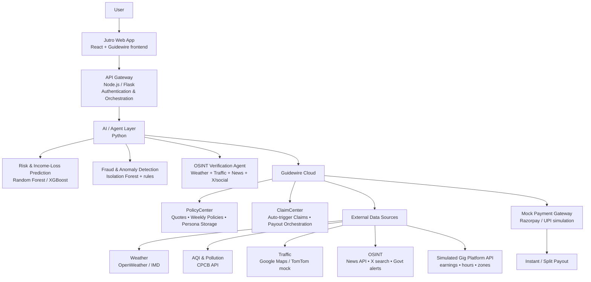

# 🚀 **Resi-Gig: Agentic Parametric Insurance for India’s Gig Economy**

**Protecting ~12 million gig workers** (2025 figure) from income shocks caused by weather, pollution, traffic, and urban disruptions — using **Guidewire Cloud + AI automation**.

 <!-- Replace with real image later -->

---

## 📌 1. Project Overview & Market Context

**Resi-Gig** is an **AI-first parametric insurance platform** running on **Guidewire Cloud**, designed exclusively for **income protection** of gig workers (food delivery, ride-hailing, quick commerce).

Key differentiators vs traditional insurance:

- ❌ **No** coverage for accidents, health issues, or vehicle damage
- ✅ **Only** covers **verified loss of income** due to external triggers
- ✅ **Weekly renewable policies** (matches volatile gig income cycles)
- ✅ **Zero-touch claims**: AI + multi-source verification → instant/near-instant payouts

### Why now? India's Gig Economy in 2026

- ~**12 million gig workers** in FY 2024–25 (up 55% from 7.7 million in FY 2020–21) — Economic Survey 2025-26
- Represents **>2% of total workforce**; projected to reach **6.7%** (~23.5 million) by 2029–30, contributing **₹2.35 lakh crore** to GDP
- ~40% earn **< ₹15,000/month**; high income volatility
- Delivery riders (core persona) average **₹18,000–₹22,000 net monthly** (~₹4,500–₹5,500/week) after fuel/maintenance
- Extreme weather causes **20–40% income drop** on bad days/weeks (heatwaves reduce hours by 1–2/day; heavy rain/floods halt operations for 5–10 hours)

**Resi-Gig** bridges this protection gap — inspired by emerging parametric pilots in India (SEWA heatwave insurance, Bajaj Allianz ClimateSafe, Digit AQI-linked policies).

---

## 👤 2. Persona Scenario – “Ravi the Rider”

- **Age**: 26
- **Platform**: Food delivery (Swiggy/Zomato/Blinkit-style)
- **Location**: Tier-1/2 city flood-prone & high-AQI area (e.g., Delhi, Mumbai, Bengaluru, Hyderabad)
- **Weekly active hours**: 50–62
- **Average weekly gross earnings**: ₹5,000–₹7,000 (net ~₹4,000–₹5,500 after costs)

**Typical disruption week (monsoon/heatwave/pollution spike)**:

- **Heavy rain** (>40–50 mm/hr) or AQI >300 → deliveries drop 50–80%
- **Income loss**: ₹1,200–₹2,500 in a single week
- **No fallback** — existing insurance pays ₹0 for lost earnings

**Resi-Gig outcome**:

- AI detects trigger → OSINT verifies → auto-payout ₹800–₹1,800 within hours

---

## 🎯 3. Objectives

1. Deliver **financial resilience** to gig workers facing climate & urban volatility
2. Build **fully automated, parametric system** with Guidewire at core
3. Use **AI for fairness** — dynamic risk pricing + strong fraud prevention
4. Demonstrate **scalable innovation** — agentic verification + predictive analytics

---

## 🏗️ 4. High-Level System Architecture
## System Architecture

---

## 🧩 5. Feature Implementation – Detailed & Requirement-Aligned

### 5.1 Optimized Onboarding (Zero-Input Smart Flow)

- **<60-second onboarding**
- Auto-capture: GPS city/zone, device info
- Simulated platform pull: weekly earnings (~₹5,000), active hours (~40–60)
- AI classifies persona → e.g., "HIGH_RISK_URBAN_MONSOON_RIDER"
- Guidewire: Account + Draft Policy created instantly
- Initial **trust score** (0–100) based on simulated consistency

### 5.2 AI-Powered Risk Profiling & Expected Loss Prediction

**Inputs**: Forecast weather, AQI, traffic index, historical earnings, schedule, geo-zone

**Model**: Ensemble (Random Forest + regression) → outputs

- **Risk Score** (0–1)
- **Expected weekly income loss** (₹) — e.g., ₹1,200 at risk score 0.75

**Innovations**:

- **Granular time-slot risk** (dinner 7–11 PM = 2× multiplier in rain)
- **What-if simulator** ("+20 mm rain → +₹600 loss")

### 5.3 Weekly Parametric Policy Creation

- **Duration**: 7 days (auto-renew)
- **Premium formula** (example):
→ Risk 0.8, Trust 85 → **₹42–48/week**

- **Options**: Lunch-only, Dinner-only, Full-week, Seasonal (monsoon boost)

### 5.4 Fully Automated Parametric Triggering

**Triggers** (thresholds configurable):

- Rain >40 mm/hr (3+ hours)
- AQI >300 (sustained)
- Heat index >43°C (2+ days)
- Severe traffic index + social confirmation

**Verification Agent**:

- Cross-checks weather + traffic + news/X mentions + govt alerts
- Confidence score (>85% → auto-approve)

**Geo-fencing**: Payout only if worker's GPS history shows presence in affected zone

### 5.5 Intelligent Fraud & Abuse Prevention

- **Trust Score evolution** (updates weekly)
- **Movement validation**: Low speed + GPS in delivery zones during trigger = valid
- **Anomaly models**: Duplicate claims, unnatural patterns
- **Techniques**: Isolation Forest + rule engine

### 5.6 Instant/Split Payouts

- **Calculation**: % of expected loss (e.g., 70–100%)
- **Flow**: ClaimCenter approves → mock UPI credits (70% instant, 30% post-validation)
- **Target**: <10–30 minutes for initial payout

### 5.7 Analytics & Dashboards (Jutro + Custom)

**Worker view**:

- Protected earnings this week
- Risk forecast next 7 days
- Claim history

**Admin view**:

- Active policies (~thousands scale)
- Triggered claims rate
- Fraud rate (<2% target)
- **City risk heatmap**
- **Predictive claims** ("Next week +25% due to IMD forecast")

---

## 🔌 6. Key Integrations (Real + Mocked)

- **Weather**: OpenWeatherMap / IMD API
- **AQI**: Central Pollution Control Board feeds
- **Traffic**: Google Maps Distance Matrix (mock fallback)
- **OSINT**: NewsAPI + X semantic/keyword search for event validation
- **Platform simulation** — JSON with earnings, hours, zones
- **Payments** — Razorpay/UPI mock responses

---

## 🛠️ 7. Tech Stack Summary

- **Frontend**: React + Guidewire Jutro Design System
- **Backend**: Node.js (or Flask) API layer
- **AI/ML**: Python – scikit-learn, XGBoost, pandas
- **Insurance Core**: Guidewire PolicyCenter + ClaimCenter (Gosu rules)
- **Data/Orchestration**: Mock APIs + async agents

---
## 🧠 8. Key Innovations & Differentiation

- Agentic **multi-source OSINT verification** (weather ≠ enough)
- **Hyperlocal + time-slot** risk granularity
- **Behavioral trust pricing** → honest workers save 20–30%
- **Zero-touch parametric claims** at scale
- **Predictive resilience analytics** (Resilience Index = % income protected)

---
